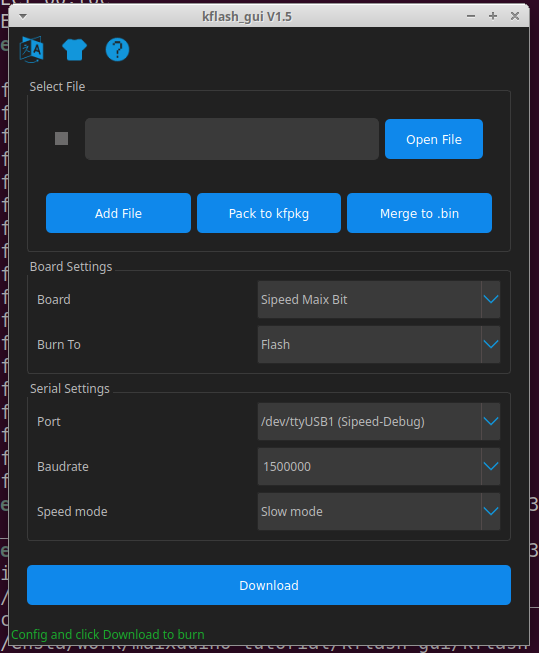

# Maixduino tutorial

> The goal of this tutorial is to set up a complete environment for the Maixduino. We'll start with an `hello_world` application.

# 1. Install `kflash` and `kflash_gui`, flash tools for the K210

```bash
sudo pip3 install kflash
git clone  --recursive https://github.com/sipeed/kflash_gui.git
cd kflash_gui
sudo apt install python3 python3-pip
sudo pip3 install -r requirements.txt
```

You may encounter an issue with the latest PyQt5 version (https://stackoverflow.com/questions/59711301/install-pyqt5-5-14-1-on-linux). In this case:

```bash
sudo python3 -m pip install pyqt5==5.14
sudo pip3 install -r requirements.txt
```

And finally:

```
python3 kflash_gui.py
```



In order to check the connectivity, please try to download `examples/first_firmware.bin`. It should work with the CLI as well:

```bash
sudo kflash examples/first_firmware.bin -p /dev/ttyUSB0
[INFO] COM Port Selected Manually:  /dev/ttyUSB0 
[INFO] Default baudrate is 115200 , later it may be changed to the value you set. 
[INFO] Trying to Enter the ISP Mode... 
._
[INFO] Automatically detected goE/kd233 

[INFO] Greeting Message Detected, Start Downloading ISP 
Downloading ISP: |====================================================================================================================| 100.0% 10kiB/s
[INFO] Booting From 0x80000000 
[INFO] Wait For 0.1 second for ISP to Boot 
[INFO] Boot to Flashmode Successfully 
[INFO] Selected Flash:  On-Board 
[INFO] Initialization flash Successfully 
Programming BIN: |====================================================================================================================| 100.0% 9kiB/s
[INFO] Rebooting... 
```

# 2. Install the Kendryte toolchain

Follow the instructions at: https://github.com/kendryte/kendryte-gnu-toolchain (especially the target directory for the cross-compiler `/opt/kendryte-toolchain`).

# 3. Install the Kendryte standalone SDK

Follow the instructions at: https://github.com/kendryte/kendryte-standalone-sdk (you may have to change the path to the cross-compiler built in the previous step).